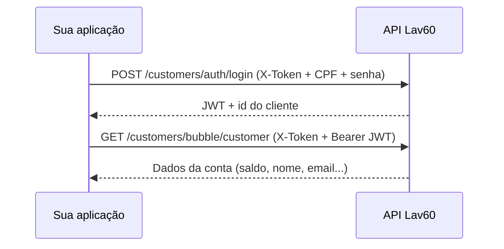

# Acesso à conta do cliente

Guia prático para autenticar um cliente (CPF + senha) e consultar os dados da conta, incluindo saldo de créditos.

---

## Visão geral

Consultar a conta exige **duas chamadas** em sequência:

```
1. Login          →  obtém JWT do cliente (válido por 30 min)
2. Consulta conta →  retorna dados completos usando o JWT
```



---

## Pré-requisitos

| Item | Descrição |
|------|-----------|
| `X-Token` | Token da API fornecido pelo painel |
| `BASE_URL` | URL do ambiente (ex.: staging) |
| CPF ou email | Credencial do cliente |
| Senha | Senha cadastrada no sistema |

### URL base

```
https://staging.lavanderia60minutos.com.br
```

> **Atenção:** o domínio correto é `lavanderia` (com **a**), não `lavenderia`.

Configure no `.env`:

```env
BASE_URL=https://staging.lavanderia60minutos.com.br
X_TOKEN=seu_x_token_aqui
```

**Via servidor unificado:** `http://127.0.0.1:3100/totem` — ver [totem-via-servidor.md](./totem-via-servidor.md).

O CPF e a senha **não precisam** ficar no `.env` se você usar o script interativo (`npm run access`).

---

## Passo 1 — Login do cliente

Autentica o cliente e retorna um token JWT.

| | |
|---|---|
| **Método** | `POST` |
| **URL** | `/api/v1/customers/auth/login` |
| **Autenticação** | Header `X-Token` |

### Headers

```
X-Token: {seu_token_api}
Content-Type: application/json
```

### Body

Informe **exatamente um** identificador — email **ou** CPF/CNPJ (nunca os dois):

```json
{
  "tax_id_number": "05791897405",
  "password": "sua_senha"
}
```

Ou com email:

```json
{
  "email": "joao.silva@example.com",
  "password": "sua_senha"
}
```

| Campo | Tipo | Obrigatório | Descrição |
|-------|------|-------------|-----------|
| `email` | String | Condicional | Email do cliente |
| `tax_id_number` | String | Condicional | CPF ou CNPJ (com ou sem pontuação) |
| `password` | String | Sim | Senha do cliente |

### Resposta de sucesso (200)

```json
{
  "data": {
    "id": "06d2fd3d-6a34-4c25-9db4-36624f58a073",
    "email": "joao.silva@example.com",
    "token": "eyJhbGciOiJIUzI1NiJ9...",
    "time": "2026-07-11T01:12:43.946+00:00"
  }
}
```

| Campo | Descrição |
|-------|-----------|
| `data.id` | UUID do cliente |
| `data.token` | JWT para usar nas próximas requisições |
| `data.time` | Expiração do token (30 minutos após criação) |

### Exemplo cURL

```bash
curl -X POST "https://staging.lavanderia60minutos.com.br/api/v1/customers/auth/login" \
  -H "X-Token: SEU_X_TOKEN" \
  -H "Content-Type: application/json" \
  -d '{"tax_id_number":"05791897405","password":"sua_senha"}'
```

---

## Passo 2 — Consultar conta do cliente

Retorna os dados completos do cliente autenticado, incluindo **saldo de créditos**.

| | |
|---|---|
| **Método** | `GET` |
| **URL** | `/api/v1/customers/bubble/customer` |
| **Autenticação** | Dupla: `X-Token` + `Authorization: Bearer {jwt}` |

### Headers

```
X-Token: {seu_token_api}
Authorization: Bearer {jwt_do_passo_1}
Accept: application/json
```

Não há parâmetros de query ou body. O cliente é identificado automaticamente pelo JWT.

### Resposta de sucesso (200)

```json
{
  "data": {
    "id": "06d2fd3d-6a34-4c25-9db4-36624f58a073",
    "type": "customers",
    "attributes": {
      "first-name": "João",
      "last-name": "Silva",
      "email": "joao.silva@example.com",
      "phone": "11987654321",
      "tax-id-number": "05791897405",
      "credits": "1033.84",
      "status": "active",
      "registration-store-code": "PB05",
      "birthdate": "1985-03-28",
      "virtual-store": false,
      "tax-id-number-validated": true,
      "created-at": "2025-03-27T14:42:41.943-03:00",
      "updated-at": "2026-05-25T16:48:58.795-03:00"
    }
  }
}
```

### Campos mais usados

| Campo | Tipo | Descrição |
|-------|------|-----------|
| `attributes.credits` | String | **Saldo de créditos** (decimal com 2 casas) |
| `attributes.first-name` | String | Primeiro nome |
| `attributes.last-name` | String | Sobrenome |
| `attributes.email` | String | Email |
| `attributes.phone` | String | Telefone |
| `attributes.tax-id-number` | String | CPF/CNPJ |
| `attributes.status` | String/Integer | Status (`active`, `suspended`, ou `0`/`1`) |
| `attributes.registration-store-code` | String | Loja onde o cliente se cadastrou |
| `attributes.birthdate` | String | Data de nascimento |
| `attributes.virtual-store` | Boolean | Acesso à loja virtual |

### Exemplo cURL

```bash
curl -X GET "https://staging.lavanderia60minutos.com.br/api/v1/customers/bubble/customer" \
  -H "X-Token: SEU_X_TOKEN" \
  -H "Authorization: Bearer SEU_JWT_TOKEN" \
  -H "Accept: application/json"
```

---

## Script interativo (recomendado)

O projeto inclui um script que executa os dois passos automaticamente.

### Configuração

No `.env`, configure apenas a API:

```env
BASE_URL=https://staging.lavanderia60minutos.com.br
X_TOKEN=seu_x_token
```

### Executar

Modo interativo — digite CPF e senha quando solicitado:

```powershell
npm run access
```

Saída esperada:

```
Acesso à conta Lav60

CPF: 05791897405
Senha: ****

Acessando conta...

Conta do cliente

ID                 : 06d2fd3d-6a34-4c25-9db4-36624f58a073
Nome               : AYLTON JUNIOR
Email              : ayltonjunior@gmail.com
Saldo de créditos  : R$ 1033.84
Status             : ativo
Loja de cadastro   : PB05
...
```

### Com argumentos (sem prompt)

```powershell
npm run access -- 05791897405 sua_senha
```

### Outros scripts relacionados

| Comando | Descrição |
|---------|-----------|
| `npm run login` | Apenas login (retorna JWT) |
| `npm run account` | Consulta conta usando credenciais do `.env` |

Arquivos:

- `scripts/access.js` — script interativo principal
- `scripts/lib/client.js` — funções de login e consulta
- `scripts/lib/prompt.js` — entrada de CPF e senha

---

## Erros comuns

| Status | Causa | Ação |
|--------|-------|------|
| **401** | `X-Token` ausente, inválido ou JWT expirado | Verifique token da API ou faça login novamente |
| **404** | Cliente não encontrado (CPF/email incorreto) | Confira credenciais |
| **400** | Body inválido (email e CPF juntos, senha ausente) | Envie apenas email **ou** CPF + senha |
| **fetch failed / ENOTFOUND** | URL base incorreta | Use `lavanderia60minutos.com.br` (com **a**) |

### JWT expirado

O token dura **30 minutos**. Se receber 401 na consulta da conta, execute o login novamente para obter um novo JWT.

---

## Endpoints relacionados

Após autenticar o cliente, o mesmo JWT pode ser usado em:

| Endpoint | Descrição |
|----------|-----------|
| `POST /api/v1/payments/pix_to_hipag` | Pagamento PIX para compra de créditos |
| `POST /api/v1/sales/totem_sales` | Criar venda no totem |

Todos exigem `X-Token` + `Authorization: Bearer {jwt}`.

---

## Referências

- [Login do cliente](../api/api-customers-auth-login.md)
- [Dados do cliente (Bubble)](../api/api-customers-bubble-customer.md)
- Collection Postman: `postman/Lav60-API-Clients.postman_collection.json`
