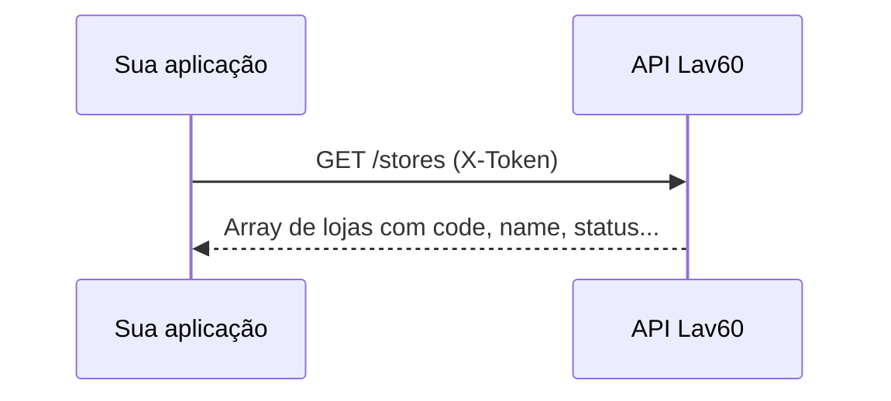

# Listar lojas

Guia prático para consultar as lojas cadastradas no sistema. Este endpoint é usado para exibir unidades disponíveis, obter o `store_code` e validar o status de cada loja antes de operações como compra de créditos ou vendas no totem.

---

## Visão geral

```
GET /api/v1/stores  →  lista de lojas (ordenadas por código)
```



### Onde entra no fluxo do totem

```
1. Login do cliente        ✅  acesso-conta-cliente.md
2. Consultar conta         ✅  acesso-conta-cliente.md
3. Listar lojas            ←  este documento
4. Listar produtos         ✅  listar-produtos.md
5. Validar cupom / PIX / Venda
```

---

## Pré-requisitos

| Item | Descrição |
|------|-----------|
| `X-Token` | Token da API fornecido pelo painel |
| `BASE_URL` | URL do ambiente |

### URL base

```
https://staging.lavanderia60minutos.com.br
```

Configure no `.env`:

```env
BASE_URL=https://staging.lavanderia60minutos.com.br
X_TOKEN=seu_x_token_aqui
```

> **Atenção:** o domínio correto é `lavanderia` (com **a**), não `lavenderia`.

---

## Endpoint

| | |
|---|---|
| **Método** | `GET` |
| **URL** | `/api/v1/stores` |
| **Autenticação** | Header `X-Token` apenas |
| **JWT do cliente** | Não necessário |

### Headers

```
X-Token: {seu_token_api}
Accept: application/json
```

---

## Parâmetros de query (opcionais)

| Parâmetro | Tipo | Obrigatório | Descrição |
|-----------|------|-------------|-----------|
| `status` | String | Não | Filtra lojas por status |

### Valores aceitos para `status`

| Valor | Descrição |
|-------|-----------|
| `active` | Loja ativa |
| `suspended` | Loja suspensa |
| `implantation` | Em implantação |
| `point` | Ponto |
| `rental` | Locação |
| `paused` | Pausada |
| `cancellation` | Distrato |

### Exemplos de URL

```
GET /api/v1/stores
GET /api/v1/stores?status=active
GET /api/v1/stores?status=suspended
```

### Comportamento

- Lojas retornadas **ordenadas por `code`** (crescente).
- Em produção, lojas de desenvolvimento são excluídas automaticamente.
- Sem filtro de `status`, retorna lojas de todos os status.

---

## Resposta de sucesso (200)

Formato **JSON:API** — array em `data`:

```json
{
  "data": [
    {
      "id": "653bb70b-b9bf-4be2-ade3-889853081dfc",
      "type": "stores",
      "attributes": {
        "name": "Mangabeiras",
        "code": "AL01",
        "tax_id_number": "12.345.678/0001-90",
        "city": "Maceió",
        "state": "AL",
        "opening-time": "08:00:00",
        "closing-time": "22:00:00",
        "reboot-time": "03:00:00",
        "zipcode": "57000-000",
        "power-air": "low",
        "accept-cash": true,
        "accept-card": true,
        "machine-type": "single",
        "dosage-model": "dry_contact",
        "execute-machine-method": "totem",
        "pinpad-serial": "ABC123",
        "tef-code": "001",
        "water-level": 1,
        "soap-level": 1,
        "softener-level": 1,
        "status": "active",
        "need-to-update": false,
        "pagarme-id-ref": "ref_123",
        "updated-at": "2024-01-15T10:30:00Z",
        "authorized-users": ["123.456.789-00"],
        "sport-softener": true,
        "floral-softener": true,
        "fractional-time": 30,
        "double-dosage": false,
        "hibank-status": "active"
      }
    }
  ]
}
```

---

## Campos mais usados

| Campo | Tipo | Descrição |
|-------|------|-----------|
| `id` | UUID | Identificador único da loja |
| `attributes.code` | String | **Código da loja** — usado em vendas, PIX e cupons (`store_code`) |
| `attributes.name` | String | Nome da loja |
| `attributes.status` | String | Status atual (`active`, `suspended`, etc.) |
| `attributes.city` | String | Cidade |
| `attributes.state` | String | Estado (sigla, ex.: `SP`) |
| `attributes.opening-time` | String | Horário de abertura |
| `attributes.closing-time` | String | Horário de fechamento |
| `attributes.accept-cash` | Boolean | Aceita dinheiro |
| `attributes.accept-card` | Boolean | Aceita cartão |
| `attributes.execute-machine-method` | String | Método de execução (`totem`, `blynk`) |
| `attributes.hibank-status` | String | Status HiBank (quando aplicável) |

### Campos operacionais (totem)

| Campo | Descrição |
|-------|-----------|
| `attributes.machine-type` | `single` ou `multiple` |
| `attributes.sport-softener` | Amaciante esportivo disponível |
| `attributes.floral-softener` | Amaciante floral disponível |
| `attributes.fractional-time` | Tempo fracionado (minutos) |
| `attributes.authorized-users` | CPFs autorizados na loja |

---

## Exemplos cURL

### Listar todas as lojas

```bash
curl -X GET "https://staging.lavanderia60minutos.com.br/api/v1/stores" \
  -H "X-Token: SEU_X_TOKEN" \
  -H "Accept: application/json"
```

### Listar apenas lojas ativas

```bash
curl -X GET "https://staging.lavanderia60minutos.com.br/api/v1/stores?status=active" \
  -H "X-Token: SEU_X_TOKEN" \
  -H "Accept: application/json"
```

---

## Erros comuns

| Status | Causa | Ação |
|--------|-------|------|
| **401** | `X-Token` ausente ou inválido | Verifique o token no painel |
| **fetch failed / ENOTFOUND** | URL base incorreta | Use `lavanderia60minutos.com.br` (com **a**) |

---

## Uso do `store_code`

O campo `attributes.code` é reutilizado como `store_code` nos endpoints seguintes:

| Endpoint | Uso |
|----------|-----|
| `GET /api/v1/products?store_code=AL01` | Preços promocionais por loja |
| `POST /api/v1/coupons/{code}/validate` | Validar cupom na loja |
| `POST /api/v1/payments/pix_to_hipag` | Pagamento PIX na loja |
| `POST /api/v1/sales/totem_sales` | Venda no totem |
| `GET /api/v1/report_credit_purchases` | Relatório por loja |

**Exemplo:** se a loja retorna `"code": "PB05"`, use `store_code: "PB05"` nas requisições seguintes.

---

## Postman

Collection: `postman/Lav60-Listar-Lojas.postman_collection.json`

Requests:
- **Listar Lojas**
- **Listar Lojas (ativas)**

Variáveis necessárias: `base_url`, `x_token`

## Script

```powershell
npm run stores
npm run stores -- --status active
```

---

## Referências

- [Acesso à conta do cliente](./acesso-conta-cliente.md)
- [Documentação técnica original](../api/api-get-stores.md)
- [Produtos por loja](../api/api-products.md)
