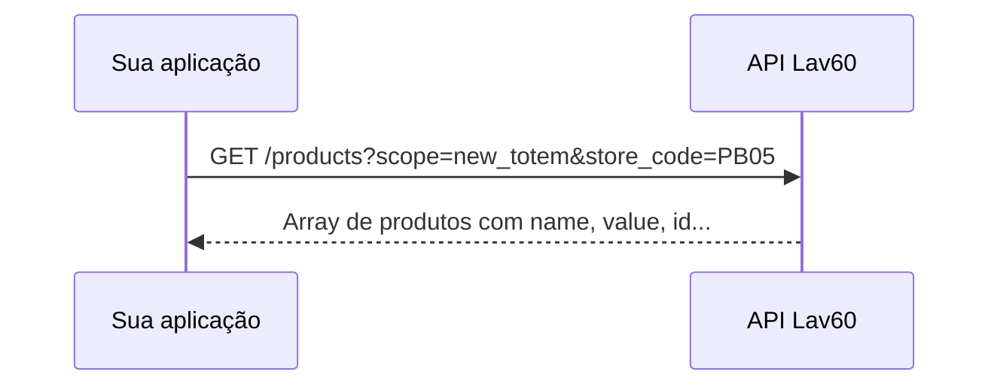

# Listar produtos

Guia prático para consultar o catálogo de produtos do totem. Use este endpoint para exibir serviços disponíveis (lavagem, secagem, etc.) e obter o `product_id` necessário em vendas e pagamentos PIX.

---

## Visão geral

```
GET /api/v1/products  →  lista de produtos (escopo totem por padrão)
```



### Onde entra no fluxo do totem

```
1. Login do cliente        ✅  acesso-conta-cliente.md
2. Consultar conta         ✅  acesso-conta-cliente.md
3. Listar lojas            ✅  listar-lojas.md
4. Listar produtos         ✅  listar-produtos.md
5. Validar cupom / PIX / Venda
```

---

## Pré-requisitos

| Item | Descrição |
|------|-----------|
| `X-Token` | Token da API fornecido pelo painel |
| `BASE_URL` | URL do ambiente |
| `store_code` | Recomendado para `scope=new_totem` (obtido em listar lojas) |

### URL base

```
https://staging.lavanderia60minutos.com.br
```

Configure no `.env`:

```env
BASE_URL=https://staging.lavanderia60minutos.com.br
X_TOKEN=seu_x_token_aqui
STORE_CODE=PB05
PRODUCT_SCOPE=new_totem
```

> **Atenção:** o domínio correto é `lavanderia` (com **a**), não `lavenderia`.

---

## Endpoint

| | |
|---|---|
| **Método** | `GET` |
| **URL** | `/api/v1/products` |
| **Autenticação** | Header `X-Token` apenas |
| **JWT do cliente** | Não necessário |

### Headers

```
X-Token: {seu_token_api}
Accept: application/json
```

---

## Parâmetros de query (opcionais)

| Parâmetro | Tipo | Obrigatório | Descrição |
|-----------|------|-------------|-----------|
| `scope` | String | Não | Escopo do catálogo. Padrão: `totem` |
| `store_code` | String | Não | Código da loja — usado para promoções e validação de suspensão |

### Valores de `scope`

| Valor | Descrição |
|-------|-----------|
| `totem` | Padrão — catálogo clássico do totem |
| `new_totem` | Catálogo do novo totem, com preço promocional por loja |
| `virtual_store` | Loja virtual |

### Comportamento por escopo

| Escopo | Campos extras | Preço |
|--------|---------------|-------|
| `totem` (padrão) | `billing-method-name`, `coupon_value` | Valor padrão |
| `new_totem` | Apenas campos essenciais | Pode usar promoção da loja quando `store_code` é informado |
| Outros | Varia conforme entidade | Valor padrão |

---

## Exemplos de URL

```
GET /api/v1/products
GET /api/v1/products?scope=totem
GET /api/v1/products?scope=new_totem&store_code=PB05
GET /api/v1/products?scope=virtual_store
```

---

## Resposta de sucesso (200)

Formato **JSON:API** — array em `data`.

### Escopo padrão (`totem`)

```json
{
  "data": [
    {
      "id": "30d8ceb2-95f6-4378-8d05-f446a387fc42",
      "type": "products",
      "attributes": {
        "name": "Secagem",
        "value": "15.00",
        "product-type": "service",
        "billing-method-name": "avulso",
        "coupon_value": 5.0
      }
    }
  ]
}
```

### Escopo `new_totem` + loja

```json
{
  "data": [
    {
      "id": "9917bc86-b72e-4d8d-a418-0257afa4615d",
      "type": "products",
      "attributes": {
        "name": "Lavagem dupla",
        "value": "20.0",
        "product-type": "service"
      }
    }
  ]
}
```

> Com `scope=new_totem` e `store_code`, o campo `value` pode refletir o preço promocional da loja.

---

## Campos mais usados

| Campo | Tipo | Descrição |
|-------|------|-----------|
| `id` | UUID/Integer | **ID do produto** — usado em vendas e PIX |
| `attributes.name` | String | Nome do produto (ex.: Lavagem, Secagem) |
| `attributes.value` | String | Valor formatado com 2 casas decimais |
| `attributes.product-type` | String | Tipo: `service`, `product`, etc. |
| `attributes.billing-method-name` | String | Método de cobrança (escopo totem) |
| `attributes.coupon_value` | Number | Valor de cupom associado (quando houver) |

---

## Exemplos cURL

### Catálogo padrão (totem)

```bash
curl -X GET "https://staging.lavanderia60minutos.com.br/api/v1/products" \
  -H "X-Token: SEU_X_TOKEN" \
  -H "Accept: application/json"
```

### Novo totem com preço por loja

```bash
curl -X GET "https://staging.lavanderia60minutos.com.br/api/v1/products?scope=new_totem&store_code=PB05" \
  -H "X-Token: SEU_X_TOKEN" \
  -H "Accept: application/json"
```

---

## Script

### Configuração mínima (`.env`)

```env
BASE_URL=https://staging.lavanderia60minutos.com.br
X_TOKEN=seu_x_token
```

### Executar

Catálogo padrão:

```powershell
npm run products
```

Novo totem com loja específica:

```powershell
npm run products -- --scope new_totem --store PB05
```

Ou via `.env`:

```env
PRODUCT_SCOPE=new_totem
STORE_CODE=PB05
```

### Saída esperada

```
Produtos (10) — scope=new_totem | loja=PB05

- [9917bc86-b72e-4d8d-a418-0257afa4615d] Lavagem dupla — R$ 20.0 (tipo: service)
- [30d8ceb2-95f6-4378-8d05-f446a387fc42] Secagem — R$ 15.00 (tipo: service)
```

Arquivos:
- `scripts/products.js`
- `scripts/lib/client.js` → `getProducts()`

---

## Erros comuns

| Status | Causa | Ação |
|--------|-------|------|
| **401** | `X-Token` ausente ou inválido | Verifique o token no painel |
| **404** | `store_code` informado, mas loja não existe | Confira o código em listar lojas |
| **fetch failed / ENOTFOUND** | URL base incorreta | Use `lavanderia60minutos.com.br` (com **a**) |

---

## Uso do `product_id`

O campo `id` de cada produto é reutilizado nos endpoints seguintes:

| Endpoint | Uso |
|----------|-----|
| `POST /api/v1/payments/pix_to_hipag` | Compra de crédito para produto específico |
| `POST /api/v1/sales/totem_sales` | Item da venda (`sale_items[].product_id`) |

**Exemplo:** para vender "Secagem", use o `id` retornado neste endpoint no body da venda.

---

## Postman

Collection: `postman/Lav60-Listar-Produtos.postman_collection.json`

Requests:
- **Listar Produtos (totem)**
- **Listar Produtos (new_totem + loja)**

Variáveis: `base_url`, `x_token`, `store_code`, `product_scope`

---

## Referências

- [Listar lojas](./listar-lojas.md) — obter `store_code`
- [Acesso à conta do cliente](./acesso-conta-cliente.md)
- [Documentação técnica original](../api/api-products.md)
- [Venda no totem](../api/api-sales-totem_sales.md)
