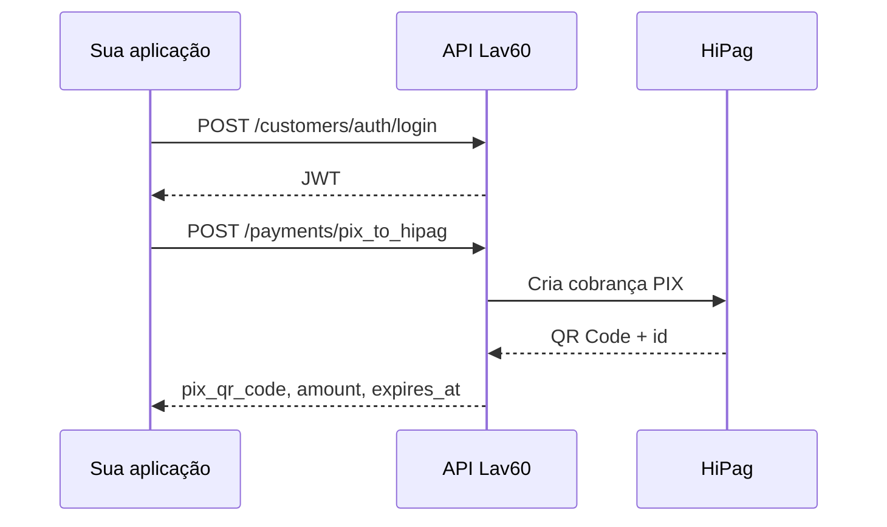

# Pagamento PIX (HiPag)

Guia prático para gerar um pagamento PIX e compra de crédito no totem. Requer cliente autenticado (JWT) e loja com HiBank configurado.

---

## Visão geral

```
POST /api/v1/payments/pix_to_hipag  →  QR Code PIX + CreditPurchase (not_paid)
```



### Onde entra no fluxo do totem

```
1. Login do cliente        ✅  acesso-conta-cliente.md
2. Listar lojas/produtos   ✅
3. Validar cupom (opc.)    ✅  validar-cupom.md
4. Pagamento PIX           ✅  pagamento-pix.md
5. Venda no totem          ←  este documento
```

---

## Pré-requisitos

| Item | Descrição |
|------|-----------|
| `X-Token` | Token da API |
| JWT do cliente | Obtido no login (30 min) |
| `store_code` | Loja com HiBank ativo |
| `amount` | Valor da compra de crédito |

---

## Endpoint

| | |
|---|---|
| **Método** | `POST` |
| **URL** | `/api/v1/payments/pix_to_hipag` |
| **Autenticação** | Dupla: `X-Token` + `Authorization: Bearer {jwt}` |

### Headers

```
X-Token: {seu_token_api}
Authorization: Bearer {jwt_do_cliente}
Content-Type: application/json
```

### Body

```json
{
  "store_code": "PB05",
  "amount": 50.00,
  "product_id": "uuid-do-produto",
  "coupon_code": "ABC1234"
}
```

| Campo | Tipo | Obrigatório | Descrição |
|-------|------|-------------|-----------|
| `store_code` | String | Sim | Código da loja |
| `amount` | Float | Sim | Valor do pagamento |
| `product_id` | UUID | Não | Produto específico |
| `coupon_code` | String | Não | Cupom validado previamente |

---

## Resposta de sucesso (200)

```json
{
  "data": {
    "id": "uuid-do-pagamento",
    "status": "pending",
    "amount": 50.00,
    "pix_qr_code": "00020126360014BR.GOV.BCB.PIX...",
    "pix_qr_code_base64": "iVBORw0KGgoAAAANSUhEUgAA...",
    "expires_at": "2024-01-15T11:30:00Z",
    "created_at": "2024-01-15T10:30:00Z"
  }
}
```

| Campo | Descrição |
|-------|-----------|
| `data.id` | ID HiPag — vira `id_ref` da CreditPurchase |
| `data.status` | `pending`, `paid`, `expired`, etc. |
| `data.pix_qr_code` | Código copia e cola |
| `data.pix_qr_code_base64` | Imagem QR Code em base64 |
| `data.expires_at` | Expiração do QR Code |

### Comportamento interno

Após resposta do HiPag, o sistema cria `CreditPurchase` com:
- `status`: 1 (not_paid)
- `origin`: physical_store
- `purchase_ref`: MATERA_PIX
- `id_ref`: ID retornado pelo HiPag

---

## Erros comuns

| Status | Causa |
|--------|-------|
| **401** | JWT ou X-Token inválido/expirado |
| **400** | Loja sem HiBank, valor inválido ou erro HiPag |
| **400** + `401 Unauthorized` | HiPag rejeitou a loja — credenciais HiBank/HiPag inválidas no ambiente (não é erro do seu login) |
| **403** | Loja suspensa |

---

## Exemplo cURL

```bash
curl -X POST "https://staging.lavanderia60minutos.com.br/api/v1/payments/pix_to_hipag" \
  -H "X-Token: SEU_X_TOKEN" \
  -H "Authorization: Bearer SEU_JWT" \
  -H "Content-Type: application/json" \
  -d '{"store_code":"PB05","amount":50.00,"coupon_code":"ABC1234"}'
```

---

## Script interativo

```powershell
npm run pix
npm run pix:check          # listar lojas com HiBank
npm run pix:check active   # filtrar por status active
```

Fluxo: CPF → senha → valor → loja → cupom (opcional) → gera PIX.

Com valor e loja fixos (login interativo):

```powershell
npm run pix -- 50.00 PB05
```

Variáveis `.env` opcionais:

```env
STORE_CODE=PB05
PIX_AMOUNT=50.00
PRODUCT_ID=uuid-do-produto
COUPON_CODE=ABC1234
```

---

## Postman

Collection: `postman/Lav60-Pagamento-PIX.postman_collection.json`

---

## Referências

- [Validar cupom](./validar-cupom.md)
- [Documentação técnica original](../api/api-payments-pix-to-hipag.md)
