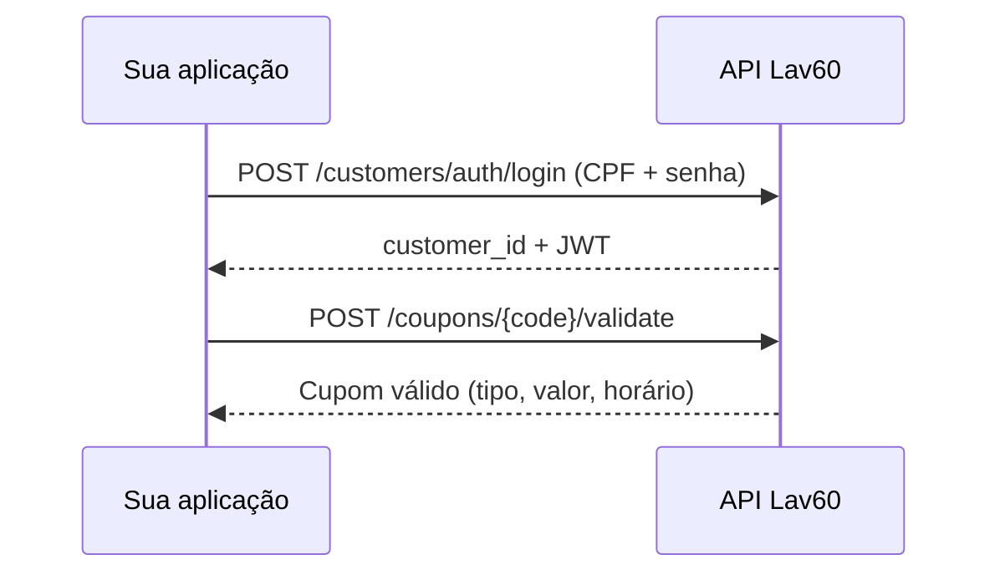

# Validar cupom

Guia prático para verificar se um cupom pode ser usado por um cliente em uma loja específica. A validação **não aplica** o cupom — apenas confirma se ele está disponível. Após validar, informe o código nos endpoints de compra de crédito (PIX).

---

## Visão geral

```
POST /api/v1/coupons/{code}/validate  →  dados do cupom ou erro
```



### Onde entra no fluxo do totem

```
1. Login do cliente        ✅  acesso-conta-cliente.md
2. Consultar conta         ✅  acesso-conta-cliente.md
3. Listar lojas            ✅  listar-lojas.md
4. Listar produtos         ✅  listar-produtos.md
5. Validar cupom           ✅  validar-cupom.md
6. PIX / Venda totem
```

---

## Pré-requisitos

| Item | Descrição |
|------|-----------|
| `X-Token` | Token da API |
| `customer_id` | UUID do cliente (obtido no login) |
| `store_code` | Código da loja (ex.: `PB05`) |
| `code` | Código do cupom a validar |

### URL base

```
https://staging.lavanderia60minutos.com.br
```

---

## Endpoint

| | |
|---|---|
| **Método** | `POST` |
| **URL** | `/api/v1/coupons/{code}/validate` |
| **Autenticação** | Header `X-Token` apenas |
| **JWT do cliente** | Não necessário (usa `customer_id` no body) |

### Headers

```
X-Token: {seu_token_api}
Content-Type: application/json
Accept: application/json
```

### Path

| Parâmetro | Tipo | Descrição |
|-----------|------|-----------|
| `code` | String | Código do cupom (ex.: `ABC1234`) |

### Body

```json
{
  "customer_id": "06d2fd3d-6a34-4c25-9db4-36624f58a073",
  "store_code": "PB05"
}
```

| Campo | Tipo | Obrigatório | Descrição |
|-------|------|-------------|-----------|
| `customer_id` | UUID | Sim | ID do cliente |
| `store_code` | String | Sim | Código da loja |

---

## Resposta de sucesso (200)

```json
{
  "data": {
    "id": "uuid-do-cupom",
    "type": "coupons",
    "attributes": {
      "code": "ABC1234",
      "apply-method": "cash",
      "coupon-type": "bonus",
      "value": "20.00",
      "start_time": "09:00",
      "end_time": "18:00"
    }
  }
}
```

### Campos da resposta

| Campo | Descrição |
|-------|-----------|
| `attributes.code` | Código do cupom |
| `attributes.coupon-type` | `bonus` ou `discount` |
| `attributes.apply-method` | `absolute`, `percent` ou `cash` |
| `attributes.value` | Valor com 2 casas decimais |
| `attributes.start_time` | Horário inicial permitido (HH:MM) ou null |
| `attributes.end_time` | Horário final permitido (HH:MM) ou null |

### Tipos e aplicação

| coupon-type | Significado |
|-------------|-------------|
| `bonus` | Bônus de crédito |
| `discount` | Desconto |

| apply-method | Significado |
|--------------|-------------|
| `absolute` | Valor fixo |
| `percent` | Percentual |
| `cash` | Crédito em dinheiro |

---

## Erros comuns

| Status | Causa | Mensagem típica |
|--------|-------|-----------------|
| **401** | `X-Token` inválido | Unauthorized |
| **404** | Cupom ou cliente não encontrado | `Couldn't find Coupon` |
| **400** | Cupom inválido para cliente/loja | `Coupon is invalid for this customer in this store` |

### Exemplos reais (staging)

**Cupom inexistente (404):**
```json
{ "error": { "message": "404 Not Found - Couldn't find Coupon" } }
```

**Cupom existe, mas não vale para este cliente/loja (400):**
```json
{ "error": { "message": "400 Bad Request - Coupon is invalid for this customer in this store" } }
```

---

## Exemplo cURL

```bash
# 1. Login (obter customer_id)
curl -X POST "https://staging.lavanderia60minutos.com.br/api/v1/customers/auth/login" \
  -H "X-Token: SEU_X_TOKEN" \
  -H "Content-Type: application/json" \
  -d '{"tax_id_number":"05791897405","password":"sua_senha"}'

# 2. Validar cupom
curl -X POST "https://staging.lavanderia60minutos.com.br/api/v1/coupons/ABC1234/validate" \
  -H "X-Token: SEU_X_TOKEN" \
  -H "Content-Type: application/json" \
  -d '{"customer_id":"UUID_DO_CLIENTE","store_code":"PB05"}'
```

---

## Script interativo

### Configuração mínima (`.env`)

```env
BASE_URL=https://staging.lavanderia60minutos.com.br
X_TOKEN=seu_x_token
STORE_CODE=PB05
```

### Executar

Modo interativo — digite CPF, senha, cupom e loja:

```powershell
npm run coupon
```

Com argumentos (usa login do `.env`):

```powershell
npm run coupon -- ABC1234 PB05
```

### Saída esperada (sucesso)

```
Cupom válido

ID            : uuid-do-cupom
Código        : ABC1234
Tipo          : bônus
Aplicação     : crédito em dinheiro
Valor         : R$ 20.00
Horário       : 09:00 até 18:00 (se houver restrição)

Use o código do cupom nos endpoints de compra de crédito (PIX).
```

Arquivos:
- `scripts/coupon.js`
- `scripts/lib/client.js` → `validateCoupon()`

---

## Próximo passo após validar

Informe o `coupon_code` no pagamento PIX:

```json
POST /api/v1/payments/pix_to_hipag
{
  "store_code": "PB05",
  "amount": 50.00,
  "coupon_code": "ABC1234"
}
```

> A validação prévia evita erros no pagamento, mas o cupom só é consumido na compra de crédito.

---

## Postman

Collection: `postman/Lav60-Validar-Cupom.postman_collection.json`

Fluxo:
1. **Login com CPF** → salva `customer_id`
2. **Validar Cupom** → usa `coupon_code` e `store_code`

---

## Referências

- [Acesso à conta do cliente](./acesso-conta-cliente.md) — obter `customer_id`
- [Listar lojas](./listar-lojas.md) — obter `store_code`
- [Documentação técnica original](../api/api-coupons-code-validate.md)
- [Pagamento PIX](../api/api-payments-pix-to-hipag.md)
