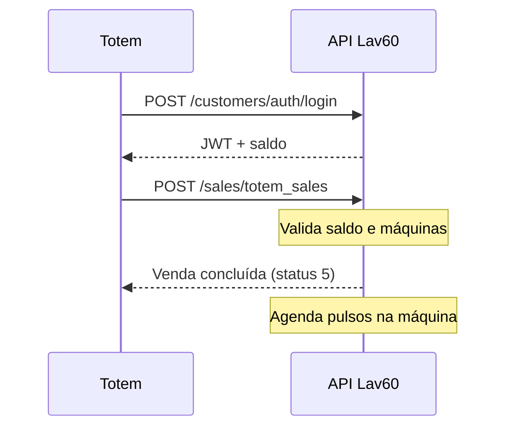

# Venda no totem

Guia prático para criar uma venda no totem físico usando créditos do cliente. O endpoint valida saldo, reserva máquinas, debita créditos e agenda a ativação.

---

## Visão geral

```
POST /api/v1/sales/totem_sales  →  venda criada + máquinas reservadas
```



### Fluxo completo do totem

```
1. Login + conta           ✅  acesso-conta-cliente.md
2. Listar lojas/produtos   ✅
3. Validar cupom (opc.)    ✅  validar-cupom.md
4. PIX (opc.)              ✅  pagamento-pix.md
5. Venda no totem          ←  este documento
```

---

## Pré-requisitos

| Item | Descrição |
|------|-----------|
| `X-Token` | Token da API |
| JWT do cliente | Login (30 min) |
| Saldo suficiente | `attributes.credits` na conta |
| `store_code` | Loja da operação |
| `product_id` | Produto escolhido (listar produtos) |
| Código da máquina | Máquina **disponível** na loja (ex.: `M01`, `L01`) |

> **Importante:** o código da máquina deve existir e estar com status `available` na loja. Código inexistente retorna erro 400.

---

## Endpoint

| | |
|---|---|
| **Método** | `POST` |
| **URL** | `/api/v1/sales/totem_sales` |
| **Autenticação** | Dupla: `X-Token` + `Authorization: Bearer {jwt}` |

### Headers

```
X-Token: {seu_token_api}
Authorization: Bearer {jwt_do_cliente}
Content-Type: application/json
```

### Body

```json
{
  "store_code": "PB05",
  "released_machine": false,
  "sale_items": [
    {
      "value": "15.00",
      "quantity": "1",
      "product_id": "a5c18a23-a50a-4afd-91ed-41d7a7864e39",
      "soap_type": "floral",
      "machines": [
        { "code": "M01" }
      ]
    }
  ],
  "payments": [
    {
      "value": "15.00",
      "payment_method": "credits"
    }
  ]
}
```

### Campos principais

| Campo | Obrigatório | Descrição |
|-------|-------------|-----------|
| `store_code` | Sim | Código da loja |
| `released_machine` | Não | Libera máquina imediatamente |
| `sale_items[].value` | Sim | Valor unitário (string) |
| `sale_items[].quantity` | Sim | Quantidade (string) |
| `sale_items[].product_id` | Sim | UUID do produto |
| `sale_items[].machines[].code` | Sim | Código da máquina |
| `sale_items[].soap_type` | Não | `floral`, `sport` ou `smelless` |
| `payments[].value` | Sim | Valor total do pagamento |
| `payments[].payment_method` | Sim | `credits`, `pix`, `credit_card` |

---

## Cálculo do total

```
total = Σ (value × quantity × número_de_máquinas)
```

**Exemplo:** 1 item a R$ 15,00, quantidade 1, 1 máquina → total = R$ 15,00

O valor em `payments[].value` deve cobrir o total calculado.

---

## Resposta de sucesso (200)

```json
{
  "data": {
    "id": "uuid-da-venda",
    "type": "sale",
    "attributes": {
      "store-code": "PB05",
      "store-id": "uuid-da-loja",
      "customer-id": "uuid-do-cliente",
      "total-value": "15.00",
      "created-at": "2024-01-15T10:30:00Z",
      "sale-items": [
        {
          "id": "uuid-do-item",
          "value": "15.00",
          "quantity": 1,
          "product_id": "a5c18a23-a50a-4afd-91ed-41d7a7864e39",
          "machines": []
        }
      ]
    }
  }
}
```

---

## Comportamento interno

1. Valida saldo do cliente
2. Verifica máquinas disponíveis (`available`)
3. Reserva máquinas (`busy`)
4. Cria venda (status 5 — concluída)
5. Debita créditos (`payment_method: credits`)
6. Agenda pulsos na máquina:
   - Secagem 45 → 3 pulsos
   - Secagem 30 → 2 pulsos
   - Outros → 1 pulso
7. **Rollback:** em caso de erro, libera máquinas reservadas

---

## Erros comuns

| Status | Causa |
|--------|-------|
| **401** | JWT ou X-Token inválido/expirado |
| **400** | Saldo insuficiente, máquina inexistente ou indisponível |
| **400** | `undefined method 'available?' for nil` — código de máquina não existe na loja |

### Exemplo (máquina inválida)

```json
{
  "error": {
    "message": "400 Bad Request - undefined method `available?' for nil:NilClass"
  }
}
```

---

## Exemplo cURL

```bash
curl -X POST "https://staging.lavanderia60minutos.com.br/api/v1/sales/totem_sales" \
  -H "X-Token: SEU_X_TOKEN" \
  -H "Authorization: Bearer SEU_JWT" \
  -H "Content-Type: application/json" \
  -d '{
    "store_code": "PB05",
    "sale_items": [{
      "value": "15.00",
      "quantity": "1",
      "product_id": "UUID_DO_PRODUTO",
      "machines": [{ "code": "M01" }]
    }],
    "payments": [{
      "value": "15.00",
      "payment_method": "credits"
    }]
  }'
```

---

## Script interativo

```powershell
npm run sale
```

Fluxo: CPF → senha → loja → escolhe produto → código da máquina → sabão (opcional) → cria venda.

Com argumentos:

```powershell
npm run sale -- PB05 UUID_PRODUTO M01 15.00
```

Variáveis `.env` opcionais:

```env
STORE_CODE=PB05
PRODUCT_ID=uuid-do-produto
MACHINE_CODE=M01
PAYMENT_METHOD=credits
```

---

## Postman

Collection: `postman/Lav60-Venda-Totem.postman_collection.json`

---

## Referências

- [Listar produtos](./listar-produtos.md) — obter `product_id` e `value`
- [Acesso à conta](./acesso-conta-cliente.md) — verificar saldo
- [Documentação técnica original](../api/api-sales-totem_sales.md)
